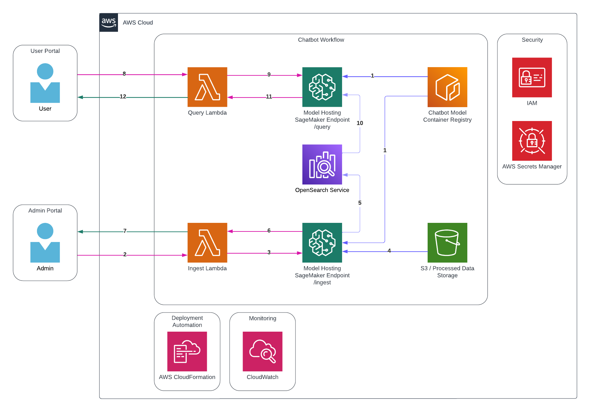

## Table of Contents
- [Introduction](#introduction)
- [Workflow](#workflow)
- [Installation](#installation)
- [Usage](#usage)

## Introduction
This project combines LangChain, AWS OpenSearch, and the Llama-2-7B-Chat LLM model to establish a rapid and efficient chatbot for document querying. 
It encompasses two models: Query and Ingest. The Query model retrieves pertinent documents from the chatbot's index to craft responses for your queries. 
Ingest prepares documents from an S3 bucket for storage as vector embeddings in a user-specified OpenSearch index.

## Workflow

The above workflow outlines the AWS solution for deploying a chatbot with two distinct routes: data
ingestion and data querying. The process follows a systematic flow as described below:

1. The data ingestion and querying endpoints are deployed on Amazon SageMaker, from a
specified container registry.

#### Ingest Route:
2. The user initiates the data ingestion process by making a request to the Ingest Lambda
function through its designated function URL.
3. The Ingest Lambda function, upon receiving the user's request, invokes the SageMaker
endpoint, targeting the '/ingest' route.
4. The SageMaker model retrieves the required data, already processed, and stored in
Amazon S3, and proceeds to create embeddings.
5. The generated embeddings are stored in an OpenSearch vector database for efficient
access and retrieval.
6. Upon completion, the SageMaker model sends a response back to the Lambda function.
7. The user is promptly notified of the ingestion process status through the response
received from the Lambda function.

#### Query Route:
8. To perform a data query, the user sends a request to the Query Lambda function using the
designated function URL.
9. The Query Lambda function, upon receiving the user's query request, invokes the
SageMaker endpoint, targeting the '/query' route.
10. The SageMaker model processes the user's query, converting it into embeddings, and
initiates a similarity search using OpenSearch. The search retrieves data related to the
query.
11. The retrieved data, along with the original query, is used by the model to generate a
prompt. The prompt is then passed to the Language Model (LLM) to generate a response.
12. The Lambda function sends back the generated response to the user, completing the
query process.

## Installation
1. Clone the repository: `git clone https://github.com/HadeelAdal/chatbot-cdk.git`
2. Navigate to the project directory: `cd chatbot-cdk`

## Usage
To deploy the project, use the following command: `cdk deploy --parameters opensearchUsername={USERNAME} --parameters opensearchPassword={PASSWORD}`

Query payload: `{"index": "{INDEX_NAME}", "bucket": "{BUCKET_NAME}", "key": "{FOLDER_KEY}"}`

Ingest payload: `{"index": "{INDEX_NAME}", "prompt": "{QUERY}"}`

## Useful commands

* `npm run build`   compile typescript to js
* `npm run watch`   watch for changes and compile
* `npm run test`    perform the jest unit tests
* `cdk deploy`      deploy this stack to your default AWS account/region
* `cdk diff`        compare deployed stack with current state
* `cdk synth`       emits the synthesized CloudFormation template
